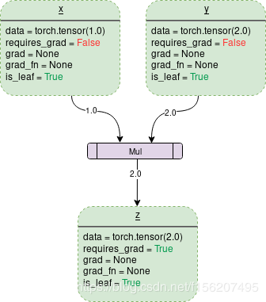

# （六）pytorch的梯度计算

版权声明：本文为CSDN博主「chen_you_Nick」的原创文章，遵循CC 4.0 BY-SA 版权协议，转载请附上原文出处链接及本声明。
原文链接：https://blog.csdn.net/f156207495/article/details/88727860

-----

## 一、基础知识

## tensors：（注意大小写）

tensor在pytorch里面是一个n维数组。我们可以通过指定参数reuqires_grad=True来建立一个反向传播图，从而能够计算梯度。

在pytorch中一般叫做dynamic computation graph(DCG)——即动态计算图。

```python
import torch
import numpy as np

# 方式一
x = torch.randn(2,2, requires_grad=True)

# 方式二
x = torch.autograd.Variable(torch.Tensor([2,3]), requires_grad=True)

#方式三
x = torch.tensor([2,3], requires_grad=True, dtype=torch.float64)

# 方式四
x = np.array([1,2,3] ,dtype=np.float64)
x = torch.from_numpy(x)
x.requires_grad = True # 或者 x.requires_grad_(True)


```

在pytorch中，只有**浮点类型**的数才有梯度，故在方法四中指定np数组的类型为float类型。为什么torch.Tensor中不需要呢，可以通过以下代码验证:

```python
>>>import torch
>>>import numpy as np

>>>a = torch.Tensor([2,3])
>>>print(a.dtype)

torch.float32
```
```python
>>>b = torch.tensor([2,3])
>>>print(b.dtype)  

torch.int64
```
```python
>>>c = np.array(2,3)
>>>print(c.dtype) 

int64
```

pytorch中tensor（开头小写）与Tensor（开头大写）的区别是什么？
首先，torch.Tensor是一个类，所有的tensor都是Tensor的一个实例；而torch.tensor是一个函数。这也说明了为什么使用torch.Tensor()没有问题而torch.tensor()却有问题。
其次，torch.tensor主要是将一个data封装成tensor，并且可以指定requires_grad。

> torch.tensor(data,dtype=None,device=None,requires_grad=False) - > Tensor

最后，我们更多地使用torch.tensor，我们可以通过使用torch.tensor(参数指定数据类型)来达到与torch.Tensor()同样的效果。
具体可参考:https://stackoverflow.com/questions/51911749/what-is-the-difference-between-torch-tensor-and-torch-tensor

---

## Dynamic Computational graph

我们来看一个计算图



解释一下各个属性的含义，

- data: 变量中存储的值，如x中存储着1，y中存储着2，z中存储着3
- requires_grad：该变量有两个值，True 或者 False，如果为True，则加入到反向传播图中参与计算。默认False.见梯度计算部分1、。
- grad：该属性存储着相关的梯度值。当requires_grad为False时，该属性为None。即使requires_grad为True，也必须在调用其他节点的
- backward()之后，该变量的grad才会保存相关的梯度值。否则为None
- grad_fn：表示用于计算梯度的函数。
- is_leaf：为True或者False，表示该节点是否为叶子节点。默认True

当调用backward函数时，只有requires_grad为true以及is_leaf为true的节点才会被计算梯度，即grad属性才会被赋予值。

---

## 梯度计算

### 1、requires_grad

​		将事先创建的变量，如x、y、z称为**创建变量**；像a、b这样由其他变量运算得到的称为**结果变量**。运算结果变量的requires_grad取决于**输入变量**。

- 例i：当变量z的requires_grad属性为True时，为了求得z的梯度，那么变量b的requires_grad就必须为true

  ```python
  from torch.autograd import Variable
  import torch

  x = Variable(torch.randn(2,2))
  y = Variable(torch.randn(2,2))
  z = Variable(torch.randn(2,2), requires_grad=True)

  a = x+y
  b = a+z

  print(x.requires_grad, y.requires_grad, z.requires_grad) 
  # False, False, True
  print(a.requires_grad, b.requires_grad) 
  # False, True
  ```

- 例ii：当变量z的requires_grad属性为True时，为了求得y的梯度，那么变量a和b的requires_grad就必须为true了

  ```python
  from torch.autograd import Variable
  import torch
  
  x = Variable(torch.randn(2,2)
  y = Variable(torch.randn(2,2), requires_grad=True)
  z = Variable(torch.randn(2,2))
  
  a = x+y
  b = a+z
  
  print(x.requires_grad, y.requires_grad, z.requires_grad) 
  # False, True, False
  print(a.requires_grad, b.requires_grad) 
  # True, True
               
  ```
  


### 2、调用backward()计算梯度

梯度计算公式如下：
$$
grad(f(a,b,...,z))=({\partial{f(a,b,...,z)} \over \partial{a}}i_1,{\partial{f(a,b,...,z)} \over \partial{b}}i_2,...,{\partial{f(a,b,...,z)} \over \partial{z}}i_j)
$$

在pytorch中的实现：

```python
f(a,b,...,z).backward()
a.grad  # a方向上的分量
b.grad  # b方向上的分量
...
z.grad  # z方向上的分量
```

例：

```python
import torch as t
from torch.autograd import Variable as v

# a是创建变量
a = v(t.FloatTensor([2, 3]), requires_grad=True) 
#b c out是结果变量
b = a + 3
c = b * b * 3
out = c.mean() # 等价于累加再除以c的数目，是标量
out.backward(retain_graph=True) 
# 这里可以不带参数，默认值为‘1’，由于下面我们还要求导，故加上retain_graph=True选项

print(a.grad) # tensor([15., 18.])

```


### 3、backward中的gradient参数使用

a. 待求梯度的结果变量为**标量（scalar）**，调用out.backward()实现。这里空置参数，相当于默认调用了

```python
out.backward(gradient=None)
```

或者:

```python
out.backward(gradient=torch.Tensor([1.0])
```


b. 待求梯度结果变量为**向量（vector）** ，out.backward()参数不可省略。

```python
import torch as t
from torch.autograd import Variable as V

m = V(t.FloatTensor([2, 3]), requires_grad=True)   
# 注意这里n是向量
n = V(t.zeros(2))
n[0] = m[0] ** 2
n[1] = m[1] ** 3
n.backward(gradient=t.Tensor([1,1]))
print(m.grad)  # tensor([ 4., 27.])
```

如果使用n.backward()的话，那么就会报如下的错：RuntimeError: grad can be implicitly created only for scalar outputs

**注意：这里的gradient的维度必须与n的维度相同。**其中的原理如下：

==在执行z.backward(gradient)的时候，如果z不是一个标量，那么先构造一个标量的值：L = torch.sum(z*gradient)，再计算关于L对各个leaf Variable的梯度。==

根据公式：
$$
\frac{\partial {L}}{\partial m} = \frac{\partial L}{\partial z}* \frac{\partial z}{\partial m}=gradient*\frac{\partial z}{\partial m}
$$

==若$gradient=1$，则$m.grad$的梯度不变。所以一般情况下，backward()中的t.Tensor([a,...,z])，均为1==