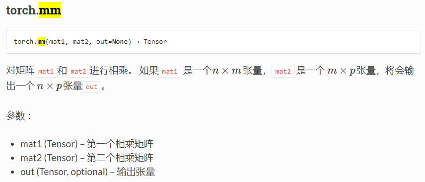
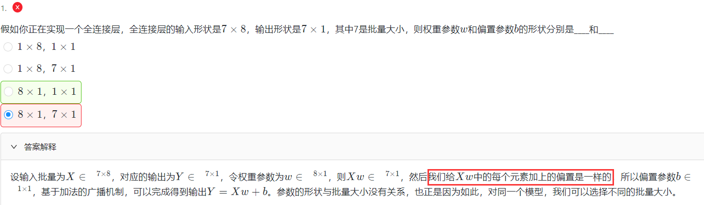
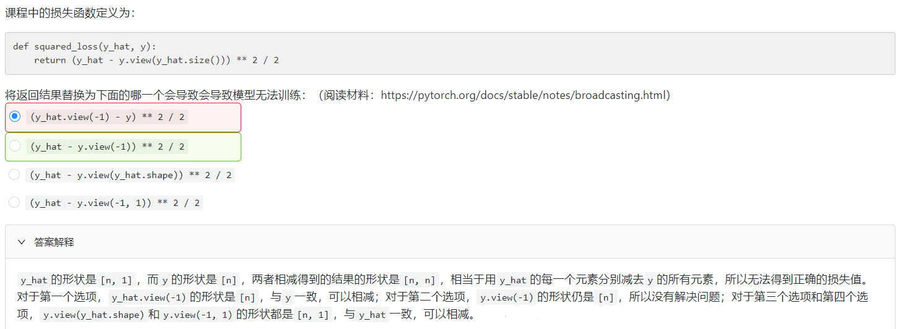

# 杂项知识点



---

##  numpy和tensor格式转换

- 将`Tensor`转换为`numpy`张量

  ```python
  a = torch.FloatTensor(2,3)
  a.detach().numpy();  # pytorch 1.0
  ```

- 将`numpy`转换为`Tensor`张量

  ```
  a = np.ones(5)
  torch.from_numpy(a)
  ```

---

## 错题回顾：

1、注意偏置参数是一样的。

2、view的用法，参见：./4、View的用法.md