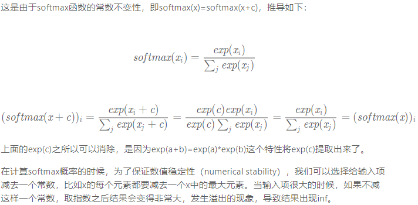

# Softmax

## 一、简单解释Softmax:

一种**==分类==**时采用的运算，将输出值变换成**①值为正数** **②和为1**的概率分布。

---

## 二、Softmax的原理

公式：
$$
\hat{y}_1,\hat{y}_2,\hat{y}_3=softmax(o1,o2,o3)
$$

其中：

$$
\hat{y}_1=\frac{exp(o_1)}{\sum^3_{i=1} exp(o_i)},
\hat{y}_2=\frac{exp(o_2)}{\sum^3_{i=1} exp(o_i)},
\hat{y}_3=\frac{exp(o_3)}{\sum^3_{i=1} exp(o_i)}
$$

容易看出$\hat{y_1}+\hat{y_2}+\hat{y_3}=1$且$0≤\hat{y_1},\hat{y_2},\hat{y_3}≤1$，因此$\hat{y_1},\hat{y_2},\hat{y_3}$是一个合法的概率分布。这时候，如果$\hat{y_2}=0.8$，不管$\hat{y_1},\hat{y_3}$的值是多少，我们都知道图像类别为猫的概率是80%。此外，我们注意到:

$$
argmax(o_i)=argmax(\hat y_j)
$$

因此softmax运算**不改变预测类别输出**。

---

## 三、Softmax的常数不变性

见课后题：

