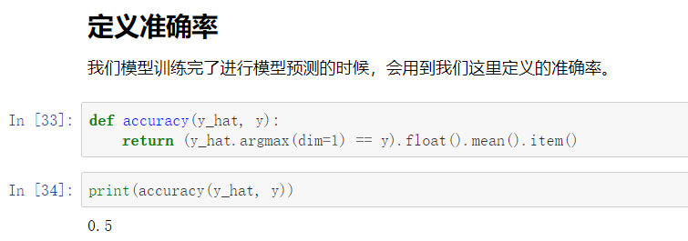

# argmax() 和max()的对比

在定义准确率时，通过对比y_hat的**坐标**与y是否相同作为判断依据。用到了argmax()函数。



通过学习，了解到：

argmax()返回最大值的**坐标**;

max()返回**最大值**与最大值的**坐标**。

例：

```python
import torch

y_hat = torch.tensor([[0.1, 0.3, 0.6], [0.3, 0.2, 0.5]])

print('argmax:', (y_hat.argmax(dim=1)).float(),'\n')
# argmax只返回【最大值的坐标】
print('max:', (y_hat.max(dim=1)))
# max返回【最大值】与【最大值的坐标】

```

结果：

```
argmax: tensor([2., 2.])

max: torch.return_types.max(
values=tensor([0.6000, 0.5000]),
indices=tensor([2, 2]))
```

