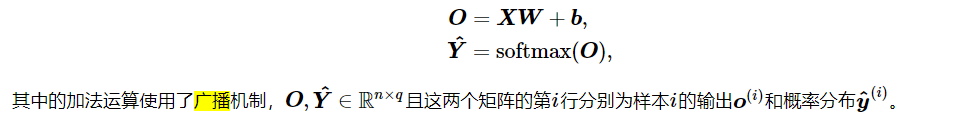
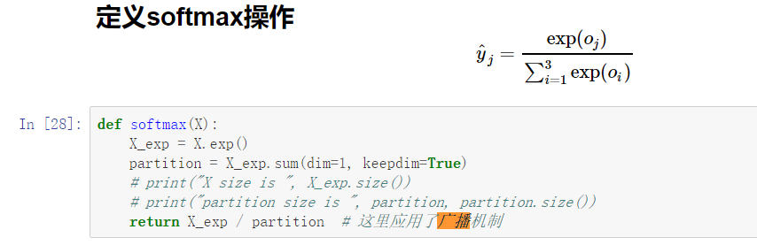
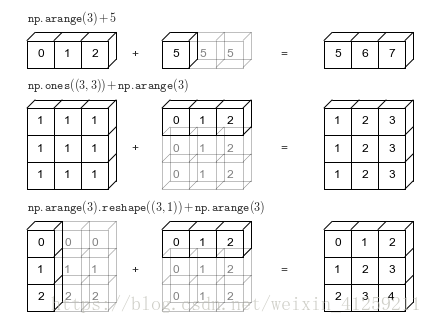

# 广播机制

Softmax的讲解中，提到了广播机制。这是numpy、torch等涉及数组的运算中特有的一种机制。

例1、矩阵$O \in R^{n*q}$ 和$b\in R^{1*1}$ 做加法



例2、定义Softmax操作时，$X\_\exp \in R^{n*q}$和$partition \in R^{n*1}$做乘法（因为除以一个矩阵，相当于乘矩阵的逆）



为了实现这些运算，引入了广播机制。

## 广播的判定

在遍历维度大小时, 如果张量满足以下条件就可以广播：

- 从尾部维度开始遍历；
- 每个张量至少有一个维度；
- 二者维度必须相等；
- 除非不相等的维度中包含1

如果x和y可以被广播，得到的张量大小的计算方法如下：

- 维度数目为x,y中维度数目中较大的值
- 维度大小为x[i]和y[j]中数目较大的值，从后往前取值。

例:

```python
import torch

x = torch.FloatTensor(5, 3, 4, 1)
y = torch.FloatTensor(1, 3, 1, 1)
z = torch.FloatTensor(      4, 1)
```
```
>>>(x+y).size()
torch.Size([5, 3, 4, 1])
```

```
>>>(z+y).size()
torch.Size([1, 1, 4, 1])
```

## 广播的计算

