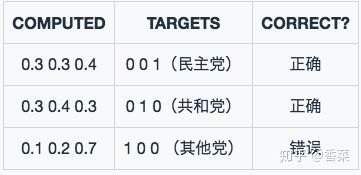
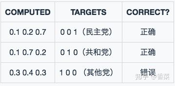
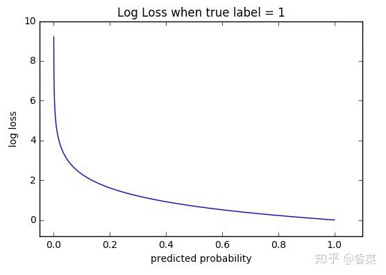
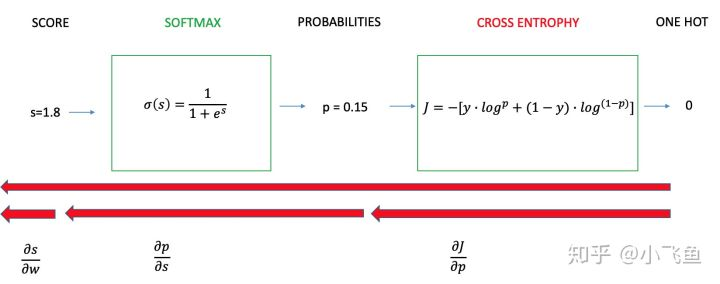
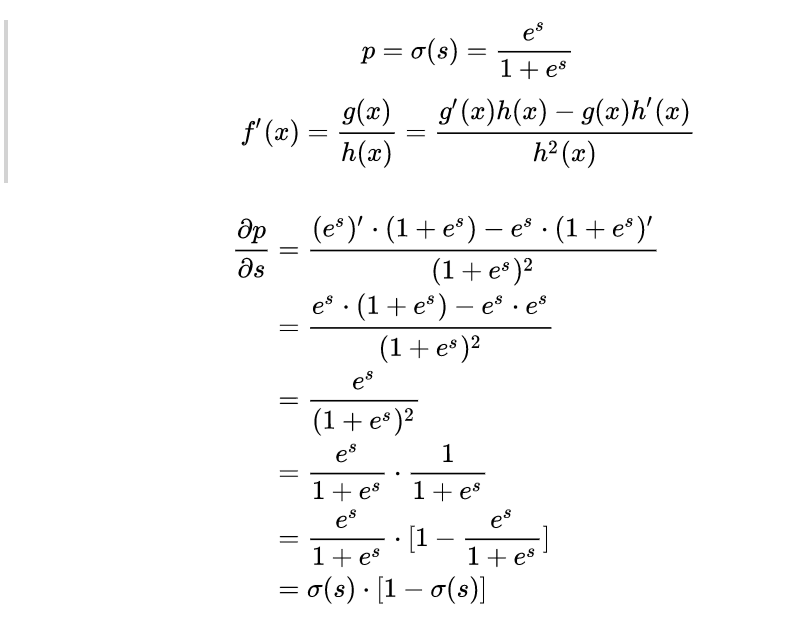

# 交叉熵损失函数

文章来源：[损失函数 - 交叉熵损失函数](https://zhuanlan.zhihu.com/p/35709485)

作者专栏：[小飞鱼](https://www.zhihu.com/people/caiconghuai)

简述：分类错误率表现损失太过简单，只能定性不定量；均方误差性能差；所以选用了交叉熵损失函数。

---

这篇文章中，讨论的Cross Entropy损失函数常用于分类问题中，但是为什么它会在分类问题中这么有效呢？我们先从一个简单的分类例子来入手。

## 1. 预测政治倾向例子

我们希望根据一个人的年龄、性别、年收入等相互独立的特征，来预测一个人的政治倾向，有三种可预测结果：民主党、共和党、其他党。假设我们当前有两个逻辑回归模型（参数不同），这两个模型都是通过sigmoid的方式得到对于每个预测结果的概率值：

**模型1**：

模型1预测结果

**模型1**对于样本1和样本2以非常微弱的优势判断正确，对于样本3的判断则彻底错误。

**模型2**：

模型2预测结果

**模型2**对于样本1和样本2判断非常准确，对于样本3判断错误，但是相对来说没有错得太离谱。

好了，有了模型之后，我们需要通过定义损失函数来判断模型在样本上的表现了，那么我们可以定义哪些损失函数呢？

## 1.1 Classification Error（分类错误率）

最为直接的损失函数定义为： ![[公式]](image/equation-1581869897556.svg)

**模型1：**  ![[公式]](image/equation-1581870700116.svg)

**模型2：** ![[公式]](image/equation-1581870700116.svg)

我们知道，**模型1**和**模型2**虽然都是预测错了1个，但是相对来说**模型2**表现得更好，损失函数值照理来说应该更小，但是，很遗憾的是， ![[公式]](image/equation-1581869897533.svg) 并不能判断出来，所以这种损失函数虽然好理解，但表现不太好。

## 1.2 Mean Squared Error (均方误差)

均方误差损失也是一种比较常见的损失函数，其定义为： ![[公式]](image/equation-1581869898230.svg)

**模型1：**

![[公式]](image/equation-1581869897555.svg)

对所有样本的loss求平均：

![[公式]](image/equation-1581869898228.svg)

**模型2：**

![[公式]](image/equation-1581869897842.svg)

对所有样本的loss求平均：

![[公式]](image/equation-1581869898229.svg)

我们发现，MSE能够判断出来**模型2**优于**模型1**，那为什么不采样这种损失函数呢？主要原因是逻辑回归配合MSE损失函数时，采用梯度下降法进行学习时，会出现模型一开始训练时，学习速率非常慢的情况（[MSE损失函数](https://zhuanlan.zhihu.com/p/35707643)）。

有了上面的直观分析，我们可以清楚的看到，对于分类问题的损失函数来说，分类错误率和均方误差损失都不是很好的损失函数，下面我们来看一下交叉熵损失函数的表现情况。

## 1.3 Cross Entropy Error Function（交叉熵损失函数）

## 1.3.1 表达式

## (1) 二分类

在二分的情况下，模型最后需要预测的结果只有两种情况，对于每个类别我们的预测得到的概率为 ![[公式]](image/equation-1581869897536.svg) 和 ![[公式]](image/equation-1581869897534.svg) 。此时表达式为：

![[公式]](https://www.zhihu.com/equation?tex=%5Cbegin%7Balign%7DL+%3D+%E2%88%92%5By%5Ccdot+log%28p%29%2B%281%E2%88%92y%29%5Ccdot+log%281%E2%88%92p%29%5D%5Cend%7Balign%7D+%5C%5C)

其中：
\- y——表示样本的label，正类为1，负类为0
\- p——表示样本预测为正的概率

## (2) 多分类

多分类的情况实际上就是对二分类的扩展：

其中：
\-  ——类别的数量；
\- ![[公式]](image/equation-1581869897538.svg) ——指示变量（0或1）,如果该类别和样本的类别相同就是1，否则是0；
\- ![[公式]](image/equation.svg) ——对于观测样本属于类别 ![[公式]](image/equation-1581869897531.svg) 的预测概率。

现在我们利用这个表达式计算上面例子中的损失函数值：

**模型1**：
![[公式]](image/equation-1581869897826.svg)

对所有样本的loss求平均：

**模型2：**

![[公式]](image/equation-1581869897554.svg)

对所有样本的loss求平均：

![[公式]](image/equation-1581869897552.svg)

可以发现，交叉熵损失函数可以捕捉到**模型1**和**模型2**预测效果的差异。

## 2. 函数性质

可以看出，该函数是凸函数（* 见7、凸优化），求导时能够得到全局最优值。

## 3. 学习过程

交叉熵损失函数经常用于分类问题中，特别是在神经网络做分类问题时，也经常使用交叉熵作为损失函数，此外，由于交叉熵涉及到计算每个类别的概率，所以交叉熵几乎每次都和**sigmoid(或softmax)函数**一起出现。

我们用神经网络最后一层输出的情况，来看一眼整个模型预测、获得损失和学习的流程：

1. 神经网络最后一层得到每个类别的得分**scores**；
2. 该得分经过**sigmoid(或softmax)函数**获得概率输出；
3. 模型预测的类别概率输出与真实类别的one hot形式进行交叉熵损失函数的计算。

学习任务分为二分类和多分类情况，我们分别讨论这两种情况的学习过程。

## 3.1 二分类情况

二分类任务学习过程

如上图所示，求导过程可分成三个子过程，即拆成三项偏导的乘积：

![[公式]](image/equation-1581869897551.svg)

## 3.1.1 计算第一项： ![[公式]](image/equation-1581869897526.svg)

\- $p$表示预测为True的概率；

\- ![[公式]](image/equation-1581869897541.svg) 表示为True时等于1，否则等于0；

![[公式]](image/equation-1581869898227.svg)

## 3.1.2 计算第二项： ![[公式]](image/equation-1581869897548.svg)

这一项要计算的是sigmoid函数对于score的导数，我们先回顾一下sigmoid函数和分数求导的公式：

## 3.1.3 计算第三项： ![[公式]](image/equation-1581869897829.svg)

一般来说，scores是输入的线性函数作用的结果，所以有：
![[公式]](image/equation-1581869897543.svg)

## 3.1.4 计算结果 ![[公式]](image/equation-1581869897540.svg)

![[公式]](image/equation-1581869897843.svg)

可以看到，我们得到了一个非常漂亮的结果，所以，使用交叉熵损失函数，不仅可以很好的衡量模型的效果，又可以很容易的的进行求导计算。

## 3.2 多分类情况

## 4. 优缺点

## 4.1 优点

在用梯度下降法做参数更新的时候，模型学习的速度取决于两个值：一、**学习率**；二、**偏导值**。其中，学习率是我们需要设置的超参数，所以我们重点关注偏导值。从上面的式子中，我们发现，偏导值的大小取决于 ![[公式]](image/equation-1581869897545.svg) 和  ，我们重点关注后者，后者的大小值反映了我们模型的错误程度，该值越大，说明模型效果越差，但是该值越大同时也会使得偏导值越大，从而模型学习速度更快。所以，使用逻辑函数得到概率，并结合交叉熵当损失函数时，在模型效果差的时候学习速度比较快，在模型效果好的时候学习速度变慢。

---

另见课后题解析