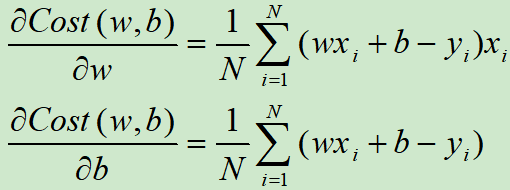

# SGD与BGD

## 随机梯度下降（stochastic gradient descent，SGD）

在每次更新时用1个样本。随机也就是说我们用样本中的一个例子来近似我所有的样本，来调整*θ*，因而随机梯度下降是会带来一定的问题，因为计算得到的并不是准确的一个梯度，**对于最优化问题，凸问题，**虽然不是每次迭代得到的损失函数都向着全局最优方向， 但是大的整体的方向是向全局最优解的，最终的结果往往是在全局最优解附近。但是相比于批量梯度，这样的方法更快，更快收敛，虽然不是全局最优，但很多时候是我们可以接受的，所以这个方法用的也比上面的多。

## 批量梯度下降（Batch Gradient Descent，BGD）

批量梯度下降：在每次更新时用所有样本，要留意，在梯度下降中，对于 ![[公式]](image/equation-1582044011335.svg) 的更新，所有的样本都有贡献，也就是参与调整 ![[公式]](image/equation-1582044011338.svg) .其计算得到的是一个标准梯度，**对于最优化问题，凸问题（见后续章节学习），**也肯定可以达到一个全局最优。因而理论上来说一次更新的幅度是比较大的。如果样本不多的情况下，当然是这样收敛的速度会更快啦。但是很多时候，样本很多，更新一次要很久，这样的方法就不合适啦。

以一元线性回归的损失函数为例:

如果N=1，此时为SGD，计算代价函数梯度的时候只考虑一个样本；

如果N=样本容量，此时为BGD，计算代价函数梯度的时候考虑全部样本；

如果N=m，1<m<N，此时为Mini-batchGD，计算代价函数梯度的时候考虑一小批样本。

---

参考文章来源:

https://www.cnblogs.com/itmorn/p/11129806.html

https://www.zhihu.com/question/264189719?sort=created 拓展内容的凸优化

