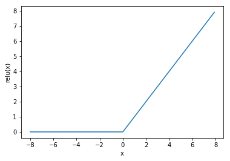
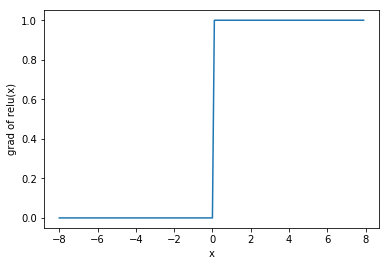
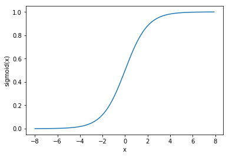
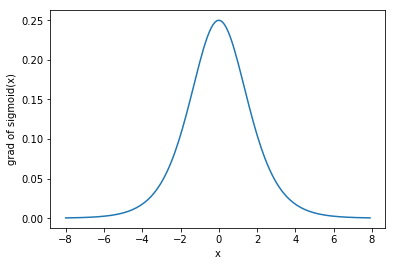
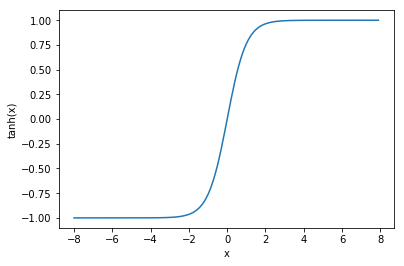
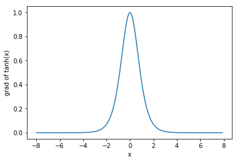

# 激活函数

以一种含单隐藏层的多层感知机为例：
$$
H=XWh+bh\\
O=HWo+bo
$$
也就是将隐藏层的输出直接作为输出层的输入。如果将以上两个式子联立起来，可以得到
$$
O=(XW_h+b_h)W_o+b_o=XW_hW_o+b_hW_o+b_o
$$
虽然神经网络引入了隐藏层，却依然等价于一个单层神经网络：其中输出层权重参数为$W_hW_o$，偏差参数为$bhWo+bo$。不难发现，即便再添加更多的隐藏层，以上设计依然只能与**仅含输出层的单层神经网络**等价。

上述问题的根源在于全连接层只是对数据做仿射变换（affine transformation），而多个仿射变换的叠加仍然是一个仿射变换。

> *仿射变换*，又称*仿射*映射，是指在几何中，一个向量空间进行一次**线性*变换***并接上一个平移，*变换*为另一个向量空间。

解决问题的一个方法是引入**非线性变换**，例如对隐藏变量使用按元素运算的非线性函数进行变换，然后再作为下一个全连接层的输入。这个非线性函数被称为**激活函数（activation function）**。

# 激活函数比较

## 1、ReLU函数：

- ### 函数原型:

  

  $$
  ReLU(x)=max(x,0)
  $$

  

- ### 求导：

  

- ### ReLU函数避免梯度消失的机制：

  ReLU有一个变种,就是在x<0时候加上很小很小的数,让他拥有斜率,不会杀死神经元,并且影响很小

## 2、Sigmoid函数

​			sigmoid函数可以将元素的值变换到0和1之间：

- ### 函数原型

  $$
  sigmoid(x)=\frac{1}{1+exp(−x)}
  $$

  

  ==取值范围：(0,1)==

- ### 求导

  $$
  sigmoid′(x)=sigmoid(x)(1−sigmoid(x))
  $$

  

  ==取值范围：(0,0.25)==

##  3、tanh函数

​		tanh（双曲正切）函数可以将元素的值变换到-1和1之间：

- ### 函数原型：

  $$
  tanh(x)=\frac{1−exp(−2x)}{1+exp(−2x)}
  $$

  

  ==取值范围：(-1,1)==

- ### 求导：

  

  ==取值范围：(0,1)==

## 4、对比：关于激活函数的选择

- ReLu函数是一个通用的激活函数，目前在大多数情况下使用。但是，ReLU函数只能在**隐藏层**中使用。
- 用于分类器时，sigmoid函数及其组合通常效果更好。由于**梯度消失**问题，有时要避免使用sigmoid和tanh函数。
- 在神经网络层数较多的时候，最好使用ReLu函数，ReLu函数比较简单计算量少，而sigmoid和tanh函数计算量大很多。
- 在选择激活函数的时候可以先选用ReLu函数如果效果不理想可以尝试其他激活函数。
- sigmoid和tanh函数虽然趋势相同，但表达式和值域完全不同，不能混为一谈。