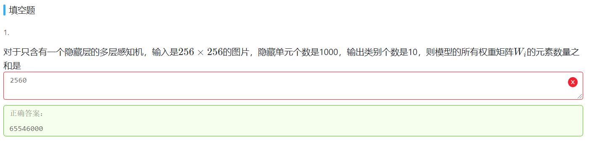

# 杂项知识点

## 

课后练习

根据《<动手学>：多层感知机》部分的讲解:

> ①给定一个小批量样本$X∈R ^{n×d}$，其**批量大小n**，**输入个数d**。
>
> ②假设多层感知机只有一个隐藏层，其中**隐藏单元个数h**。记隐藏层的输出（也称为隐藏层变量或隐藏变量）为H，有$H∈R^{n×h}$（可理解为隐藏层运算后的样本**批量大小n不变**，**输入个数d**变为**隐藏单元的数目h**）因为隐藏层和输出层均是全连接层，可以设隐藏层的权重参数和偏差参数分别为$W_h∈R^{d×h}$和 $b_h∈R^{1×h}$ （否则$H=XW_h+b_h$ 中的矩阵乘法和加法无法运算）
>
> ③输出层的权重和偏差参数分别为$W_o∈R^{h×q}$和$b_o∈R^{1×q}$（可理解为输出层运算后的样本**批量大小n不变**，**输入个数d**最终变为**输出类别个数q**）
>
> ④整理得到，含单隐藏层的多层感知机其输出$O∈R^{n×q}$的计算为:
>
> $$H=XW_h+b_h$$
>
> $$O=HW_o+b_o$$

在本题中：

- 小批量样本$X∈R ^{n×d}$，$n$代表图片数量，**未知**。d代表图片的输入**$d= 256*256=65536$** 【注意不要理解错，想当然认为**n=d=256**】

- 隐藏层单元个数**h=1000**，已知。

  ==>可得权重矩阵$W_h∈R^{d×h}$元素个数=d×h=65536000

- 输出类别个数**q=10**

  ==>可得权重矩阵$W_o∈R^{h×q}$元素个数=h×q=10000

  ==>所有权重矩阵元素个数和可得65536000+10000=65546000