#GitHub for Windows客户端的使用教程

## 什么是Github

\>说到什么是GitHub，我们先看wikipedia的描述“GitHub是一个利用Git进行版本控制、专门用于存放软件代码与内容的共享虚拟主机服务。它由GitHub公司（曾称Logical Awesome）的开发者Chris Wanstrath、PJ Hyett和Tom Preston-Werner使用Ruby on Rails编写而成。”

\>Git是一个分布式的版本控制系统，作为开源代码库以及版本控制系统，Github目前拥有很多开发者用户。随着越来越多的应用程序转移到了云上，Github已经成为了管理软件开发以及发现已有代码的首选方法。

\> Git是一个分布式的版本控制系统，最初由Linus Torvalds编写，用作Linux内核代码的管理。在推出后，Git在其它项目中也取得了很大成功，尤其是在Ruby社区中。目前，包括 Rubinius和Merb在内的很多知名项目都使用了Git。Git同样可以被诸如Capistrano和Vlad the Deployer这样的部署工具所使用。

\>如前所述，作为一个分布式的版本控制系统，在Git中并不存在主库这样的概念，每一份复制出的库都可以独立使用，任何两个库之间的不一致之处都可以进行合并。

\>GitHub可以托管各种git库，并提供一个web界面，但与其它像 SourceForge或Google Code这 样的服务不同，GitHub的独特卖点在于从另外一个项目进行分支的简易性。为一个项目贡献代码非常简单：首先点击项目站点的“fork”的按钮，然后将 代码检出并将修改加入到刚才分出的代码库中，最后通过内建的“pull request”机制向项目负责人申请代码合并。已经有人将GitHub称为代码玩家的MySpace。

 

## 准备工作

1、注册GitHub账号，进入GitHub官网https://github.com/github，创建一个账户。

2、下载GitHub for Windows，如下图，先在GitHub上创建一个仓库，创建成功后，可以看到 有个Set up in Desktop 按钮。

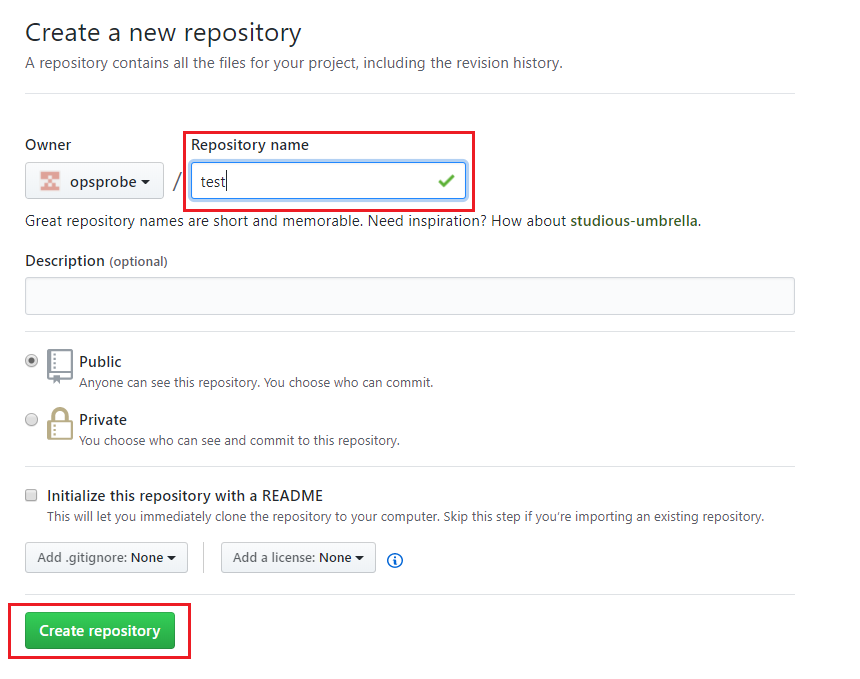

 然后单击 Set up in Desktop ，进入如下界面：

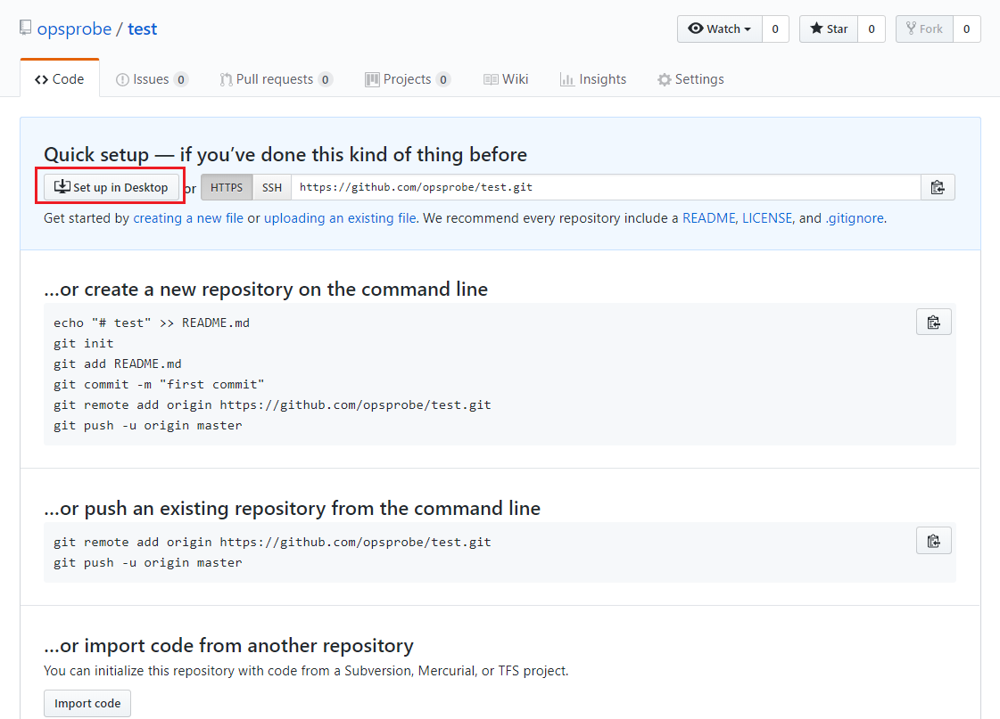

下载GitHub的Windows客户端，下载完直接运行即可。

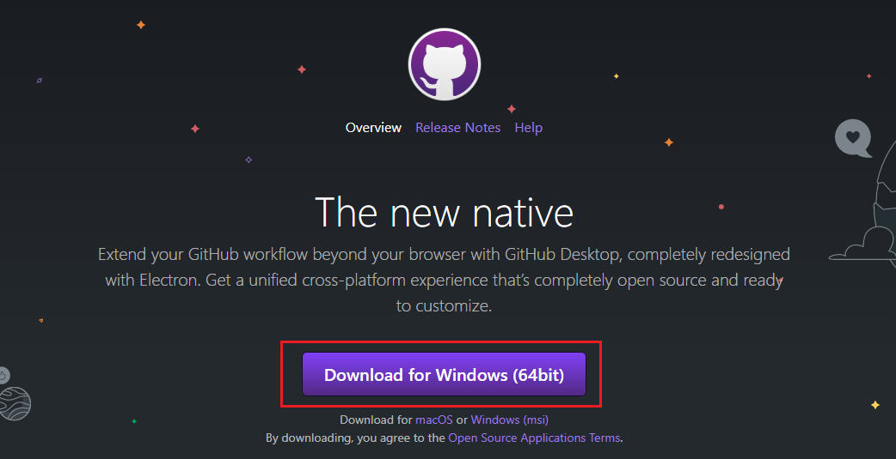

 

3、打开GitHub Desktop，如下图，输入账号和密码进行登录。

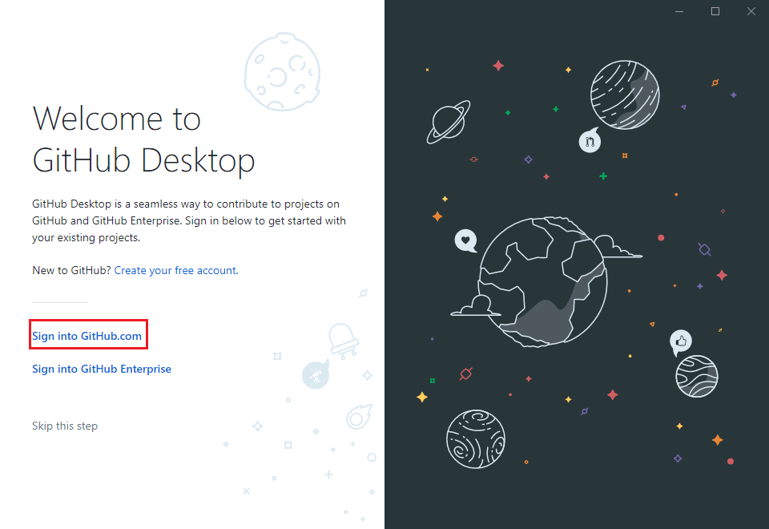

 

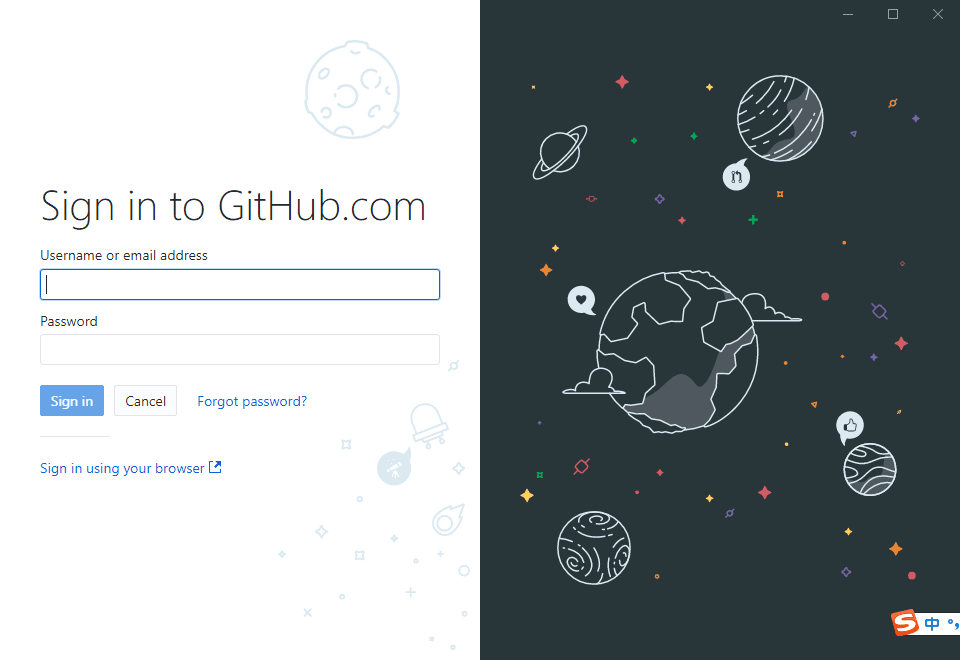

## 创建第一个代码库

## 认识界面

我们来建立第一个仓库，点击左上角的File**，**打开之后有五个选项，New repository，Add local repository，Clone repository，Options，Exit。

 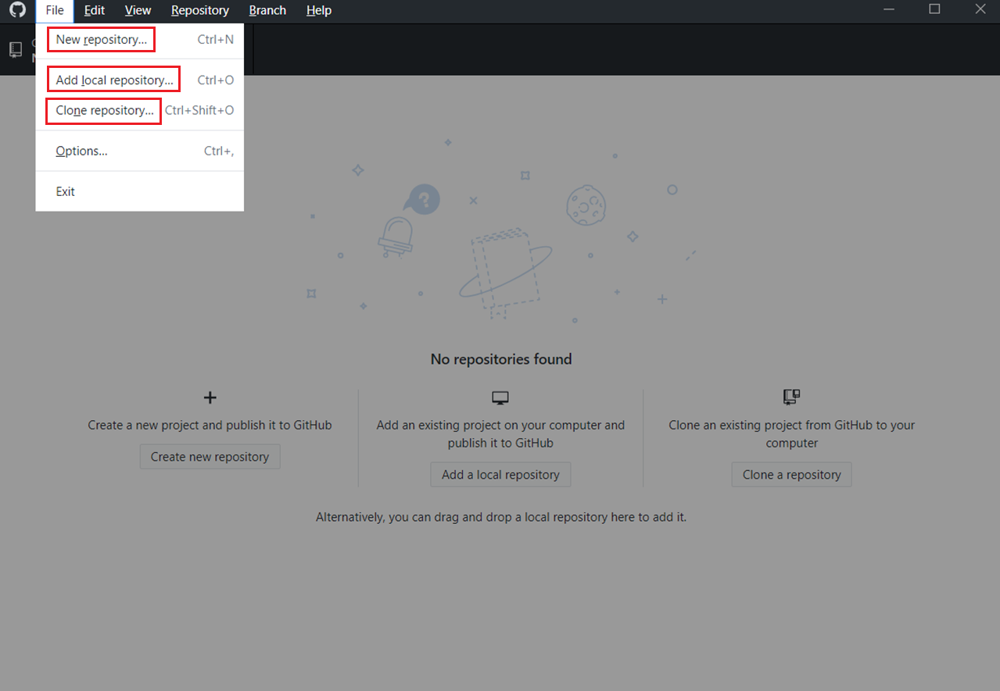

 

我们首先来新创建一个仓库：

1、点击左上角的File —> New repository，创建一个新的代码库，填写相应的信息：

 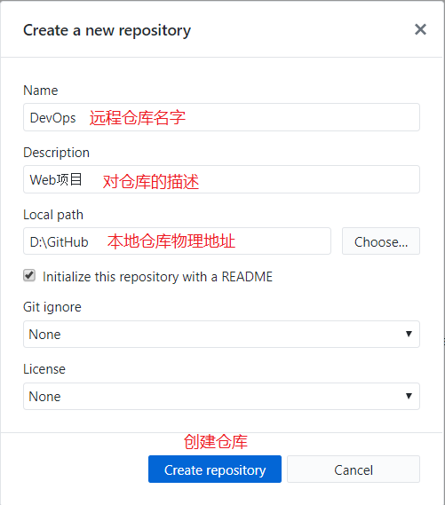

新建之后，如下图所示：

 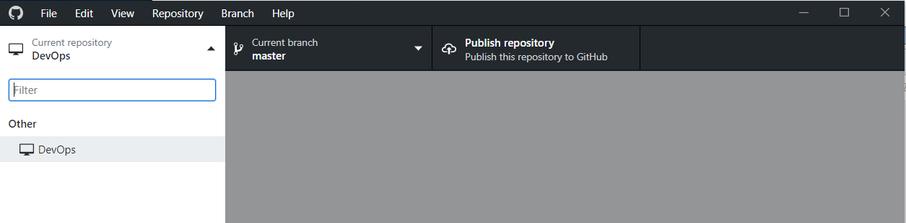

在电脑上找到我们本地路径，目录结构如图所示：（注意：.git文件是隐藏文件，且不能删除）

 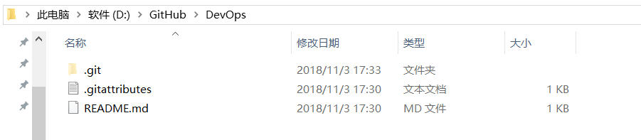

此时，只是在本地建立好了相应的本地仓库，GitHub网站上面还未上传。点击客户端上的 Publish repository 按钮进行上传，如下图：

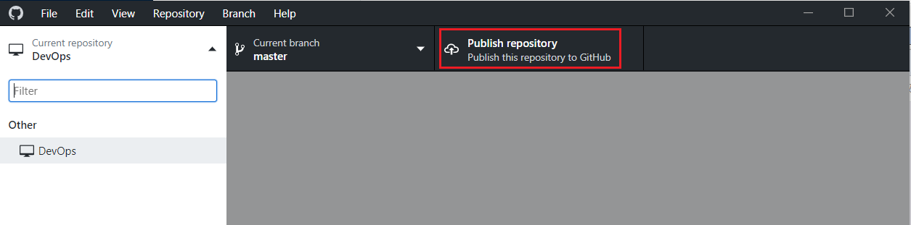

 

对要上传的仓库进行描述：

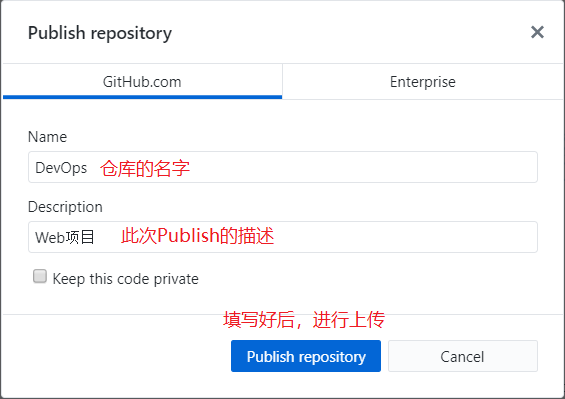

 

上传完后，新建的仓库已经成功提交到GitHub，登录GitHub网站，进入仓库（点击右上角头像，选择Your repositories），可以看到我们刚刚创建的 DevOps 仓库。

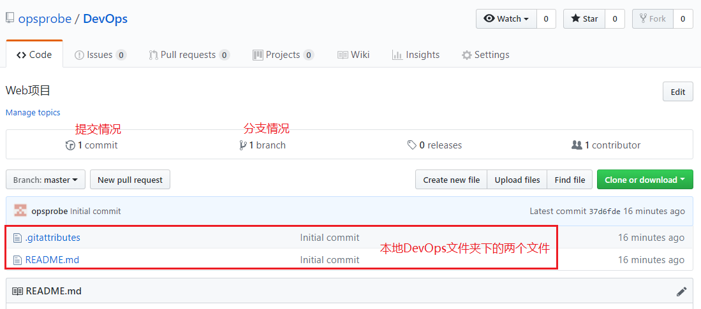

2、打开我们的本地路径（如果忘记也不要紧，在GitHub客户端里鼠标右键我们的仓库，选择选择Show in Explorer，这样我们就可以转到刚刚新建的本地仓库路径下），在里面新建文件test.txt。

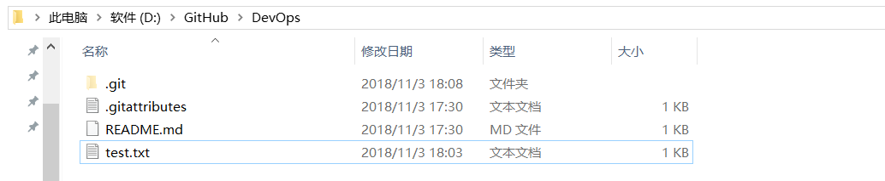

此时，打开GitHub客户端可以看到 DevOps 仓库有一个新的消息：

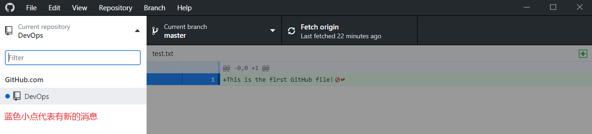

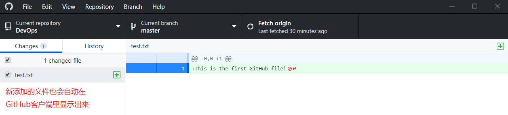

3、在客户端的下方填写相关描述，点击 Commit to master 进行提交。

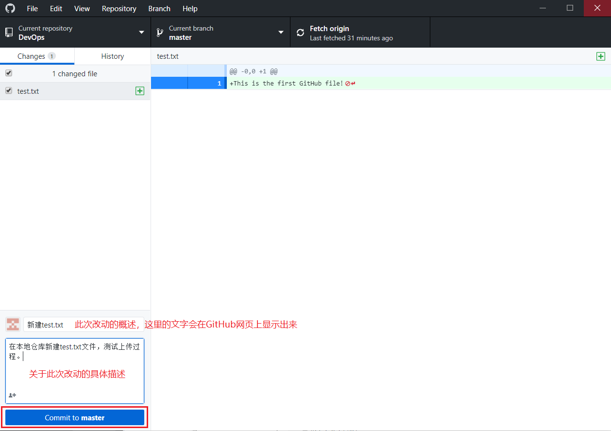

 

4、点击 Commit to master 只是让GitHub客户端记录这次进行的改动，并不会直接提交到GitHub上面去，相当于一次游戏存档，在将来的某一天如果想重玩这个存档，可以点击 Commit to master 下面的 Undo 按钮，让项目还原到这次记录的状态。如果想将本地的改动提交到GitHub网站上，点击 Push origin 上传到GitHub即可。

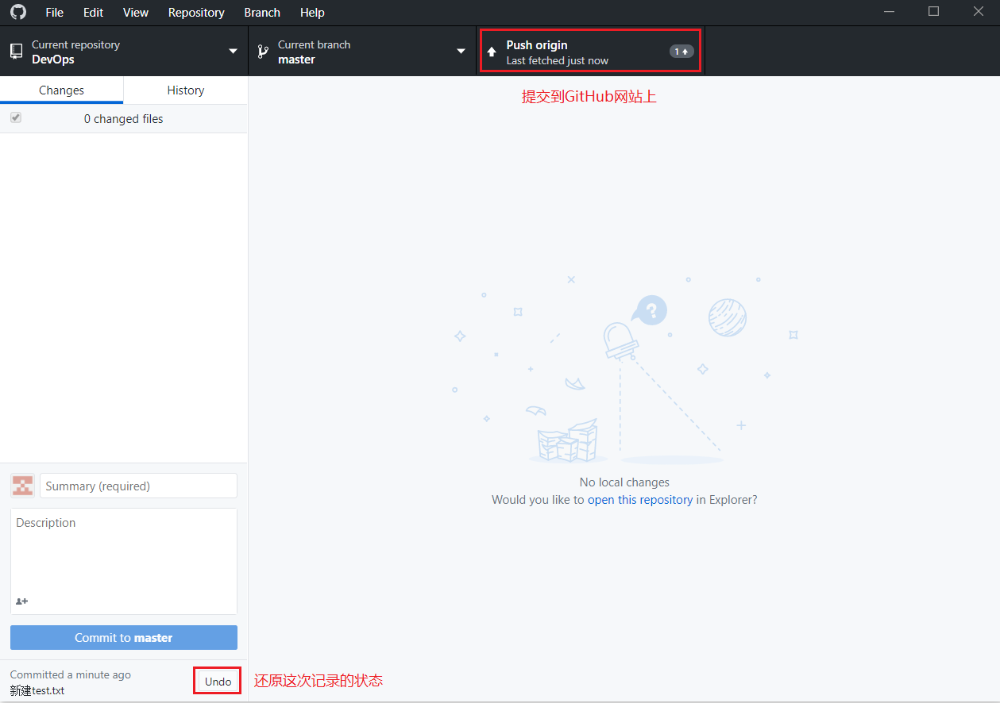

 

5、现在可以到自己的GitHub主页上查看DevOps仓库，可以看到我们新建的 test.txt 文件已经出现在主页上了。

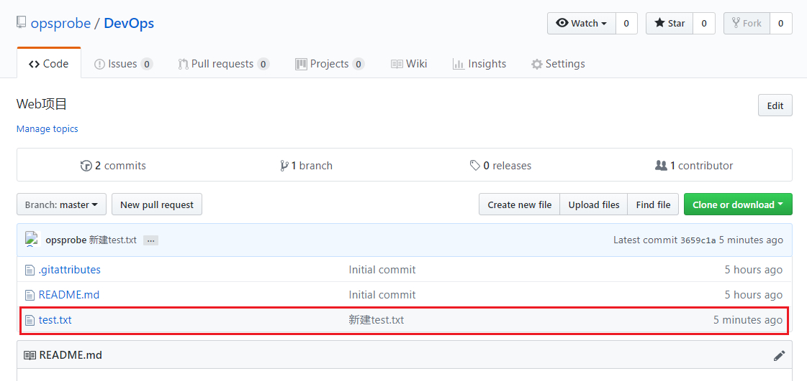

之后的每次改动，只要重复第3、4、5个步骤即可。